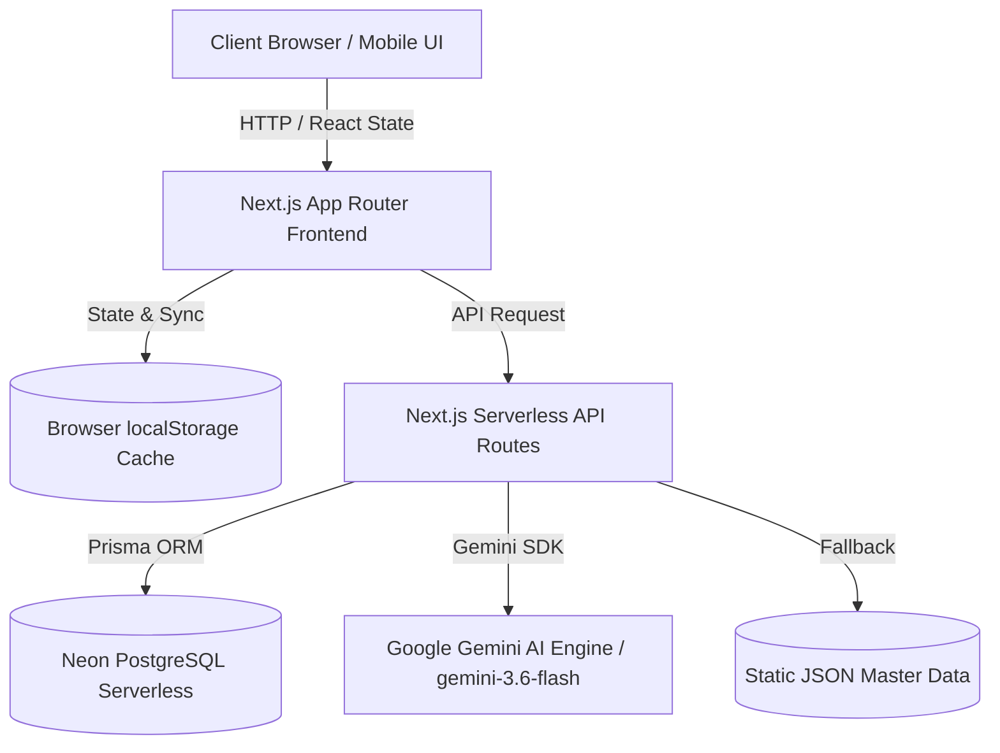

# Tài Liệu Thiết Kế Kiến Trúc Hệ Thống (System Design Specification)
## SCONNECT OMS - OBJECTIVES & PERFORMANCE MANAGEMENT SYSTEM
*Cập nhật lần cuối: 11/09/2026 | Phiên bản Kiến trúc 2.4*

---

## 🏗️ 1. TỔNG QUAN KIẾN TRÚC HỆ THỐNG (SYSTEM ARCHITECTURE)

Hệ thống Sconnect OMS được thiết kế theo kiến trúc **Full-stack Web Application trên nền tảng Next.js (App Router)** kết hợp với cơ sở dữ liệu **PostgreSQL (Neon Serverless)** và bộ công cụ trí tuệ nhân tạo **Google Gemini AI SDK**.



---

## 📊 2. THIẾT KẾ PHÂN HỆ VÀ LUỒNG DỮ LIỆU CỐT LÕI

### 2.1. Phân hệ Dashboard Tổng Hợp (`/`) & Biểu Đồ Radar 7 Mục Tiêu
- **Biểu đồ Bánh xe mục tiêu sức khỏe (Heptagon Radar Chart)**: Trực quan hóa 7 mặt mục tiêu chiến lược cốt lõi (M1 đến M7).
- **Bảng Chi tiết biến động**: Tên bảng được chuẩn hóa thành **`📈 CHI TIẾT BIẾN ĐỘNG (7 MT)`**.
- **Cơ chế Lưu trữ hai lớp (Double-Layer Data Persistence)**:
  - **Lớp 1 (Local Client Storage)**: Dữ liệu 7 mục tiêu khi bấm "Lưu dữ liệu" được ghi lập tức vào `localStorage` theo key `radar_scores_${unitCode}_${periodKey}`.
  - **Lớp 2 (Server Database)**: API `POST /api/kpi/radar-scores` cập nhật/tạo mới bản ghi `prisma.kpiData` với cờ `isOverridden = true`.
  - **Cơ chế chống mất dữ liệu khi reload (Self-Healing Fetch)**: API `GET /api/kpi/radar-scores` gửi kèm header `Cache-Control: no-store, no-cache, must-revalidate` để loại bỏ bộ nhớ đệm cũ của trình duyệt. Trên giao diện Client, React Effect đọc song song từ `localStorage` và API để hiển thị dữ liệu tức thì không bị nhảy số cũ.

### 2.2. Phân hệ Đồng Bộ Số Liệu Doanh Thu & Tỷ Trọng Nguồn
- **Số liệu Thực tế Tháng 8/2026**:
  - **Tổng Công ty (TCT - `TM1-I02.01`)**: Kế hoạch = 16.15 Tỷ VNĐ | Thực tế = 12.37 Tỷ VNĐ (**77%** hoàn thành).
  - **Khối SCME (B2B - `EM1-I02.01`)**: Kế hoạch = 9.24 Tỷ VNĐ | Thực tế = 8.60 Tỷ VNĐ (**93%** hoàn thành).
- **Cơ cấu 4 Nguồn Doanh thu TCT**:
  1. Kinh doanh MCN (SCME): **8.38 Tỷ VNĐ** (67.7%)
  2. Sáng tạo nội dung số (SCVN): **3.77 Tỷ VNĐ** (30.5%)
  3. Cấp quyền / Distribution (SCME): **186 Triệu VNĐ** (1.5%)
  4. Khai thác kho nội bộ (SCME): **36 Triệu VNĐ** (0.3%)
- **Cô lập Biểu đồ Donut Đơn vị con**: Loại bỏ "Quỹ IP" khỏi các đơn vị trực thuộc (BP AS, BP Wolfoo, SCS, SCMU, Lego, CNGP, CR...), chỉ giữ Quỹ IP duy nhất ở công ty mẹ SCVN.

### 2.3. Phân hệ OM AI Agent & Gemini AI Integration (`/api/ai/om-agent`)
- **Danh sách Mô hình Dự phòng Tự động (Model Fallback Chain)**:
  `gemini-3.6-flash` ➔ `gemini-flash-latest` ➔ `gemini-3.1-pro-preview` ➔ `gemini-3-flash-preview` ➔ `gemini-pro-latest`.
- **Tư duy Sâu (Deep Reasoning)**: Tự động tạo khối HTML `<details><summary>🧠 Phân tích tư duy chiến lược</summary></details>` trước khi phản hồi người dùng.
- **Function Calling**: Tích hợp công cụ `searchMarketTrends` tra cứu xu hướng thị trường YouTube, Spotify, Facebook Reels, Lego stop-motion và AI Agents.

---

## 🛠️ 3. THIẾT KẾ CƠ SỞ DỮ LIỆU & API ENDPOINTS

### 3.1. Bảng CSDL Cốt Lõi (`prisma.kpiData`)
```prisma
model KpiData {
  id             String   @id @default(uuid())
  unitCode       String   // SCVN, TCT, SCME, Wolfoo, Lego...
  productCode    String?  // null nếu là chỉ tiêu cấp Đơn vị
  indicatorCode String   // M1, M2, M3, M4, M5, M6, M7...
  periodKey      String   // monthly_8, weekly_8_1, quarterly_3...
  periodType     String   // weekly, monthly, quarterly, yearly
  targetValue    Float    // Giá trị Kế hoạch / Tạm tính
  actualValue    Float    // Giá trị Thực tế / Điểm mục tiêu
  explanation    String?  // Ghi chú giải trình
  isOverridden   Boolean  @default(false)
  status         String   @default("Nháp")
  updatedAt      DateTime @updatedAt
}
```

### 3.2. Danh Sách API Endpoints Chính

| Endpoint | Method | Chức Năng |
| :--- | :--- | :--- |
| `/api/kpi/radar-scores` | `GET` / `POST` | Truy vấn và lưu ghi đè điểm 7 Mặt Mục Tiêu (M1-M7) |
| `/api/kpi/unit-data` | `GET` | Truy vấn dữ liệu KPI theo Đơn vị và Kỳ báo cáo |
| `/api/kpi` | `GET` / `POST` | Quản lý danh mục chỉ số KPI và phân rã Dòng sản phẩm |
| `/api/ai/om-agent` | `POST` | Trợ lý OM AI Agent tư duy sâu & gợi ý hoạch định OKR/KPI |
| `/api/ai/okr-strategy` | `POST` | Phản biện chiến lược & kiểm định chất lượng OKR |

---

## 🛡️ 4. NGUYÊN TẮC AN TOÀN & TỰ PHỤC HỒI (RELIABILITY & GRACEFUL FALLBACK)

1. **Không ngắt quãng trải nghiệm**: Mọi truy vấn API DB/AI đều có `try-catch` và fallback dữ liệu mẫu (`lib/kpiMasterData.json`, `lib/radarMasterData.ts`).
2. **Không công khai Key**: Mọi secret key (`DATABASE_URL`, `GEMINI_API_KEY`) chỉ lưu trong biến môi trường Vercel `.env`, không bao giờ hiển thị trên giao diện người dùng hay console log.
